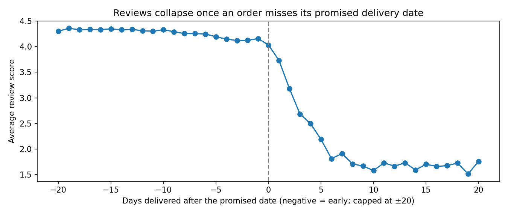
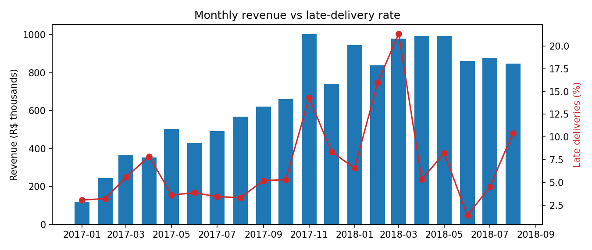
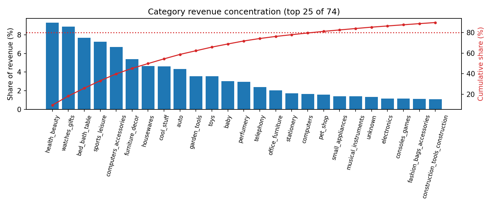

# Retail Sales Insight Study

SQL-first analysis of ~100,000 real e-commerce orders: a DuckDB data model, KPI queries,
statistical checks, an interactive dashboard, and an auto-generated executive summary with
recommendations.

**Data:** [Brazilian E-Commerce Public Dataset by Olist](https://www.kaggle.com/datasets/olistbr/brazilian-ecommerce)
(CC BY-NC-SA 4.0): 99,441 orders, 112,650 order items, and 99,224 customer reviews from a
Brazilian marketplace, September 2016 to October 2018, across 8 related tables.

## Key findings

| | |
|---|---|
| Growth | Revenue **+138%** in Jan–Aug 2018 vs Jan–Aug 2017, driven by order volume (+137%), not basket size |
| Customer experience | 8.0% of delivered orders arrived late. Late orders averaged **2.57★ vs 4.29★** for on-time orders, and 54% got 1–2 stars (vs 9%) |
| Robustness | The late-delivery gap holds within states (−1.62★ after controlling for geography); bootstrap 95% CI −1.77 to −1.69 |
| Retention | Only **3.0%** of 94,983 customers ordered more than once |
| Peak demand | Black Friday 2017 (24 Nov): 1,166 orders, 4.7× an average November day. That month's late rate rose to 14% |
| Concentration | The top 8 of 74 categories generate 50% of revenue; 18 categories generate 80% |

Full write-up with recommendations: [reports/executive_summary.md](reports/executive_summary.md).



Reviews hold steady for orders that arrive early or on time, then fall by more than 2 stars
within the first week after the promised date. Delivery promises matter more than raw delivery
speed.




## Interactive dashboard

`reports/dashboard.html` is a self-contained Plotly dashboard covering monthly revenue and
orders, top categories, reviews vs delivery timing, late rate by state, and an order heatmap
by weekday and hour. Download it and open it in any browser.

## How it works

```
8 raw CSVs → DuckDB (in memory)
           → sql/01_model.sql   clean analytical views: fact_orders, fact_items
           → sql/02_kpis.sql    9 named KPI queries
           → src/stats.py       bootstrap CI, Mann-Whitney test, state-stratified gap
           → reports/           CSVs, charts, dashboard.html, executive_summary.md
```

**Data model.** `fact_orders` joins orders, customers, items, and reviews into one row per
order. It excludes canceled and unavailable orders, keeps only the latest review when an order
has several, and flags late deliveries (delivered after the estimated date). `fact_items` adds
English category names for product-level analysis.

**Example query** (from `sql/02_kpis.sql`): year-over-year growth compares the same calendar
months so seasonality does not distort it.

```sql
SELECT
    SUM(CASE WHEN YEAR(order_month) = 2018 THEN product_revenue END) /
    SUM(CASE WHEN YEAR(order_month) = 2017 THEN product_revenue END) - 1   AS revenue_growth
FROM fact_orders
WHERE MONTH(order_month) BETWEEN 1 AND 8 AND YEAR(order_month) IN (2017, 2018);
```

**Why stratify by state?** Late deliveries are concentrated in some states (CE 15%, BA 14%,
RJ 13% vs SP 6%), and those customers could rate differently for unrelated reasons. Comparing
late vs on-time orders within each state, then averaging, removes that confounding. The gap
barely changes (−1.73★ overall vs −1.62★ within states).

## Run it

```bash
pip install -r requirements.txt
python scripts/download_data.py   # needs a Kaggle API token; see the script for setup
python -m src.pipeline            # under a minute; writes everything to reports/
pytest -q                         # unit tests, also run by GitHub Actions
```

The raw data is downloaded from Kaggle rather than redistributed here.

## Project structure

```
sql/
  01_model.sql    analytical views (fact_orders, fact_items)
  02_kpis.sql     named KPI queries
src/
  config.py       paths, tables, analysis window
  db.py           DuckDB loading and query runner
  stats.py        late-delivery statistical tests
  dashboard.py    interactive Plotly dashboard
  pipeline.py     end-to-end run, charts, executive summary
scripts/download_data.py
tests/            pytest tests run the SQL model on a small hand-checked dataset
reports/          generated outputs
```

## Limitations

- Revenue is product price only (freight excluded), in Brazilian reais.
- Reviews are observational, so the late-delivery effect is an association. Controlling for
  state strengthens the case, but other factors (product type, seller) could still contribute.
- The first and last months of the data are partial, so trend analysis uses January 2017 to
  August 2018.
